# 算法

## 一.复杂度分析

1. **复杂度分析：**表示算法的性能、通常看最差的情况、算法运行的上界

   ```java
   public static <E> int search(E[] data,E target){
           for (int i=0; i<data.length;i++){
               if (data[i].equals(target)){
                   return i;
               }
           }
           return -1;
       }
   ```

   * [上诉代码]
     *  数据规模：n=data.length
     * 算法的性能：如果算法时间满足：T = c1 * n + c2    即是 T =  O(n)
   * 常数不重要，复杂度描述的是随着数据规模n的增大，算法性能的变化趋势

2. **常见算法复杂度**
  
   - 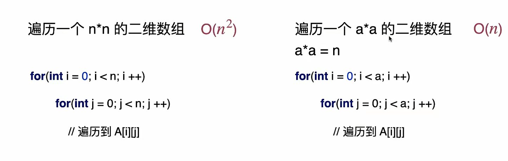
   - 上诉表达的n的意义不一样
   - 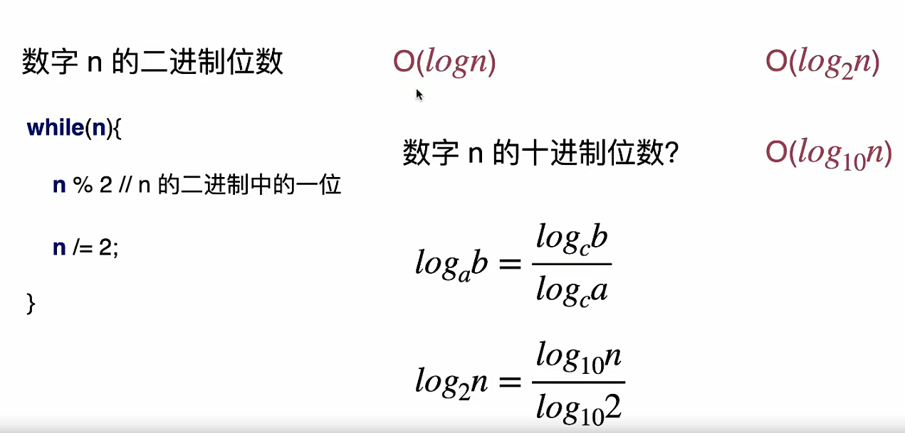
   - 不关注底数，只算O(logn)	
   - 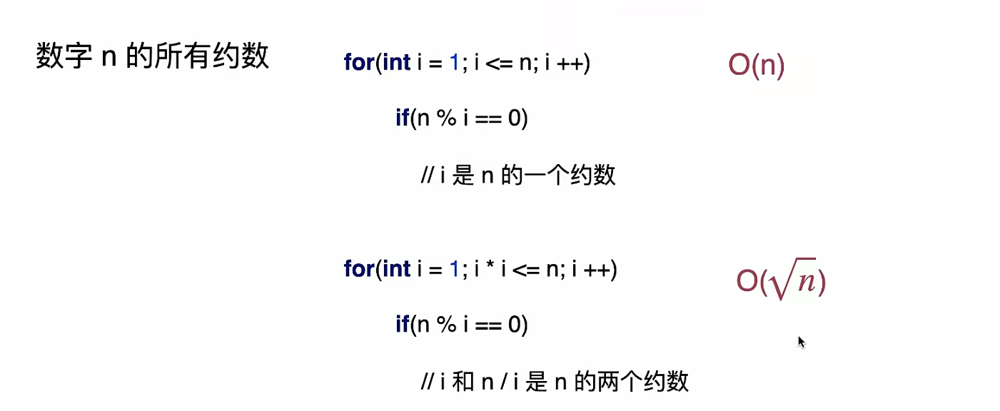
   - 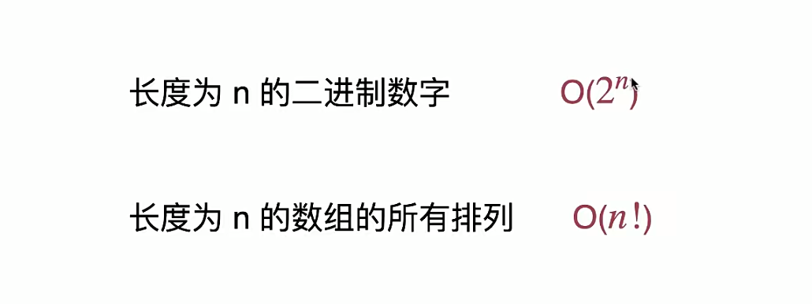
   - 上诉长度为n的二进制，每个数字可以填0or1,所以为2的n次方，全排列就是n的阶乘，这两个时间复杂度都很高，尽量避免
   - 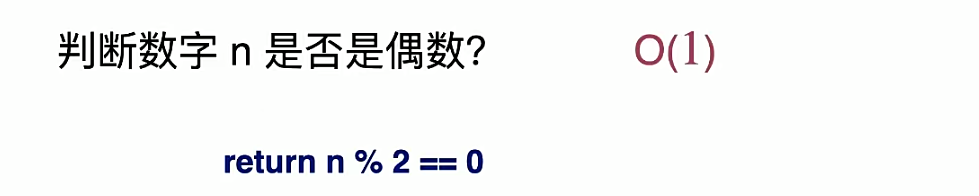
   - **总结**
   - 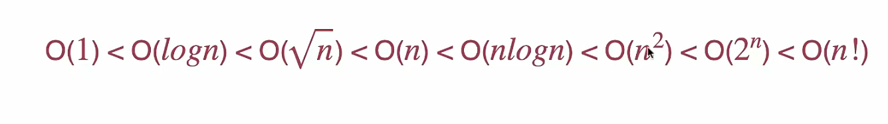
   - 空间复杂度同理，但是现在的算法很少提及空间复杂度，现计算机的内存存储是很够得，一般用空间换时间来提升算法的性能

## 二.选择排序法

###1.代码

```java
import domain.Student2;

//选择排序
public class SelectSort {
  private SelectSort(){}

//  public static void sort(int[] arr){
//      for (int i = 0; i < arr.length; i++){
//          int minIndex = i;
//          //选择 arr[i...n)中的最小索引
//          for (int j=i; j<arr.length; j++){
//              if (arr[j] < arr[minIndex]){
//                  minIndex = j;
//              }
//
//              swap(arr,i,minIndex);
//          }
//      }
//  }
    public static <E extends Comparable<E>> void sort(E[] arr) {
        for (int i = 0; i < arr.length; i++) {
            int minIndex = i;
            //选择 arr[i...n)中的最小索引
            for (int j = i; j < arr.length; j++) {
                if (arr[j].compareTo(arr[minIndex]) < 0) {
                    minIndex = j;
                }
                swap(arr, i, minIndex);
            }
        }
    }

//    private static void swap(int[] arr, int i, int minIndex) {
//      int t = arr[i];
//      arr[i] = arr[minIndex];
//      arr[minIndex] = t;
//    }
    private static <E> void swap(E[] arr, int i, int minIndex) {
        E t = arr[i];
        arr[i] = arr[minIndex];
        arr[minIndex] = t;
    }


    public static void main(String[] args) {
        Integer[] arr = {23,1,34,2,45,345,97,24};

        SelectSort.sort(arr);

        for (int i : arr){
            System.out.println(i);
        }
        System.out.println();

        Student2[] student2s = {new Student2("alice",98),
                                new Student2("jack",100),new Student2("gatsby",66)};
        SelectSort.sort(student2s);
        for (Student2 student2 : student2s){
            System.out.println(student2);
        }
    }
}

```

### 2.选择排序法的复杂度分析

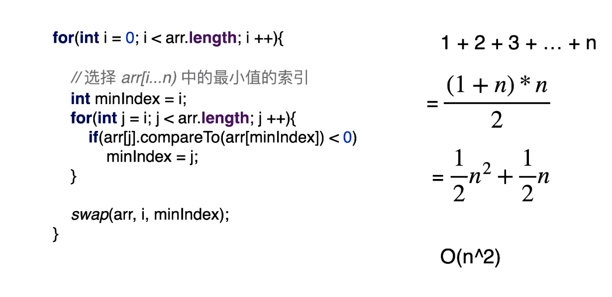

## 三.插入排序

### 1.逻辑、与选择排序的差别

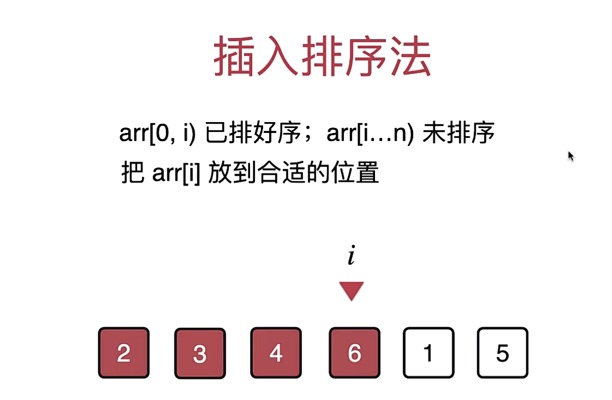

* 选择排序：选择未排序部分最小的元素放在最前面，以此类推
* 插入排序：每次只处理当前那个元素，把当前这个元素放在合适的位置上，不会动i索引还没遍历到的那些元素

### 2.代码

```java
package algorithm;

import util.ArrayGenerator;
import util.SortingHelper;

import java.util.Arrays;

//插入排序
public class InsertionSort {
    private InsertionSort(){}

    public static <E extends Comparable<E>> void sort(E[] arr){
        for (int i = 0; i< arr.length; i++){

            //将arr[i] 插入到合适的位置，与当前元素前面的元素做对比
            for (int j = i; j - 1 >= 0; j--){
                if (arr[j].compareTo(arr[j-1])<0){//如果比前面一个元素小，就换位置（插入到前面一个元素）
                    swap(arr,j,j-1);
                }else {//相反大于前面一个元素停止，他就在原本的位置上
                    break;
                }
            }
            //循环第二种写法
//            for (int j = i; j - 1 >= 0 && arr[j].compareTo(arr[j-1])<0; j--){
//                swap(arr,j,j-1);
//            }
        }
    }

    public static <E extends Comparable<E>> void sort2(E[] arr){
        for (int i = 0; i< arr.length; i++){
            //将arr[i] 插入到合适的位置，与当前元素前面的元素做对比，不做交换，直接赋值
            /**
             * 例如：2 4 6 7 3 -> 给3排序  3应该在arr[1]的位置，原来是通过一次一次交换交换到arr[1]，
             * 现在：先暂存3   -> 然后一次一次和前面一位作比较，如果小于前面一位，就把前面一位赋值（平移）到当前位置
             * 例子：2 4 6 7 3 -> 2 4 6 7 7 -> 2 4 6 6 7 -> 2 4 4 6 7 -> 2比3小不用赋值（平移）
             * 最后 -> 2 3 4 6 7
             */
            E t = arr[i];
            int j;
            for (j = i; j - 1 >= 0 && t.compareTo(arr[j-1]) < 0; j--){
                arr[j] = arr[j-1];
            }
            arr[j] = t;
        }
    }

    private static <E> void swap(E[] arr, int j, int min){
        E t = arr[j];
        arr[j] = arr[min];
        arr[min] = t;
    }

    public static void main(String[] args) {
        int[] dataSize = {10000,100000};
        for (int n : dataSize){
            Integer[] arr = ArrayGenerator.generateRandomArray(n,n);
            Integer[] arr2 = Arrays.copyOf(arr,arr.length);
            SortingHelper.sortTest("InsertionSort",arr);
            SortingHelper.sortTest("InsertionSort2",arr2);
        }
    }
}
```

### 3.插入排序特性

* 时间复杂度：**O(n²)**

*  整体，插入排序的复杂度是**O(n²)**，但对于一个**有序数据使用插入排序，他的时间复杂度是O(n)**，为什么？

  * > ```java
    > public static <E extends Comparable<E>> void sort2(E[] arr){
    >         for (int i = 0; i< arr.length; i++){
    >             E t = arr[i];
    >             int j;
    >             for (j = i; j - 1 >= 0 && t.compareTo(arr[j-1]) < 0; j--){
    >                 arr[j] = arr[j-1]; 
    >             }
    >             arr[j] = t;
    >         }
    >     }
    > ```

  * 注意看内层循环，当当前元素大于前一位的元素，循环终止，也就是说一组有序数据他内存循环永远只执行一次，就是一个常数操作。所以就是O(n)，**这是选择排序不具备的，选择排序内层循环永远执行完**

  * **对于有序或近乎有序的数组，使用插入排序更好**

#数据结构

##一.数据结构基础

### 1.什么是数据结构

- 数据结构研究的是数据如何在计算机中进行组织和存储，使得我们可以**高效的**获取数据或者修改数据。在内存世界的**增删改查**。

- 主要分为： 

  - **线性结构**：数组；栈；队列；链表；哈希表.....
  - **树结构**: 二叉树；二分搜索树；AVL；红黑树；Treap; Splay; 堆；Trie; 线段树； K-D树；并查集；哈夫曼树；......
  - **图结构**: 邻接矩阵（二维数组）；邻接表（链表的数组、红黑树的数组）

- 根据应用场景的不同，灵活的选择最合适的数据结构

- 例子：

  - ```sql
    SELECT * FROM `table` where `id` = 'xxxxx' //AVL、红黑树、B类树、哈希表
    ```

  - 操作系统---进程相关：优先队列；内存管理：内存堆栈；文件管理

  - 文件压缩---压缩算法：哈夫曼树（最基础的）

  - 游戏人物移动----寻路算法(图论算法)：DFS（使用栈 -> 深度优先遍历）、BFS（使用队列 -> 广度优先遍历）--------二分搜索时

## 二.数组

### 1.数组基础

- 把数据码成一排进行存放：

  |      |      |      |      |      |      |      |      |
  | ---- | ---- | ---- | ---- | ---- | ---- | ---- | ---- |

  索引：  0                          1                          2                          3                           4                         5                        6                         7 

- 数组**最大的优点**：***快速查询***。

- 数组最好应用于“***索引有语意***”的情况，但是并非所有有语意的索引都适用于数组：例如身份证号，太长了

### 2.代码

- ```java
  package dataStructure;
  
  //数组
  public class Array<E> {
      private E[] data;
      private int size;
  
      // 构造函数，传入数组的容量capacity构造Array
      public Array(int capacity){
          data =(E[]) new Object[capacity];
          size = 0;
      }
      //无参构造函数，默认数组容量capacity=10
      public Array(){
          this(10);
      }
  
      // 获取数组中元素个数
      public int getSize(){
          return size;
      }
  
      //获取数组容量
      public int getCapacity(){
          return data.length;
      }
  
      //判断数组是否为空
      public boolean isEmpty(){
          return size == 0;
      }
  
      //向所有元素后添加一个新元素
      public void addLast(E e){
  //        if (size == data.length){
  //            throw new IllegalArgumentException("AddLast failed. Array is full");
  //        }
  //        data[size] = e;
  //        size ++;
          add(size,e);
      }
  
      public void addFirst(E e){
          add(0,e);
      }
  
      //在index个位置插入一个新元素
      public void add(int index, E e){
          if (index < 0 || index > size){
              throw new IllegalArgumentException("Add failed. Require index >= 0 and index <= size");
          }
  
          if (size == data.length){
  //            throw new IllegalArgumentException("Add failed. Array is full");
              //如果数组满了，不抛异常了，整成动态数组
              resize(2 * data.length);
          }
          //从最后一个元素开始，每个元素像后挪一个位置（不从前面开始的原因是因为从前面开始会覆盖）
          for (int i = size -1 ; i >= index ; i --){
              data[i + 1] = data[i];
          }
          data[index] = e;
          size ++;
      }
  
      // 获取index索引位置的元素
      public E get(int index){
          if (index < 0 || index >= size){
              throw new IllegalArgumentException("Get failed. Index is illegal");
          }
          return data[index];
      }
  
      //修改index索引位置的元素e
     public void set(int index,E e){
          if (index < 0 || index >= size){
              throw new IllegalArgumentException("Get failed. Index is illegal");
          }
          data[index] = e;
      }
  
      // 查找数组中是是否有元素e
      public boolean contain(E e){
          for (int i = 0; i < size; i++){
              if (data[i].equals(e)){
                  return true;
              }
          }
          return false;
      }
  
      // 查找数组中元素e所在的索引，如果不存在元素e，则返回-1
      public int find(E e){
          for (int i = 0; i < size; i++){
              if (data[i].equals(e)){
                  return i;
              }
          }
          return -1;
      }
  
      //删除数组中index索引位置的元素，返回删除的元素
      public E remove(int index){
          if (index < 0 || index >= size){
              throw new IllegalArgumentException("Remove failed. Index is illegal");
          }
          E ret = data[index];
          //删除当前位置的元素，就是把当前索引后面的元素像前挪动一位，最后调整size，data[size]的元素不用管，用户也看不见，当默认值
          for (int i = index+1; i < size; i++){
              data[i - 1] = data[i];
          }
          size --;
          data[size] = null;//改成泛型之后，如果是引用类型，那么存在一个垃圾回收机制忽略的问题，给他置为空
          //当数组的元素小于数组容量1/4，给他删一半
          if (size == data.length / 4 && data.length / 2 != 0){
              resize(data.length / 2);
          }
          return ret;
      }
  
      public E removeFirst(){
          return remove(0);
      }
  
      public E removeLast(){
          return remove(size-1);
      }
  
      //从数组中删除元素e
      public void removeElement(E e){
          int index = find(e);
          if (index != -1){
              remove(index);
          }
      }
  
      @Override
      public String toString(){
          StringBuilder res = new StringBuilder();
          res.append(String.format("Array: size = %d , capacity = %d\n", size, data.length));
          res.append('[');
          for (int i = 0 ; i < size ; i ++){
              res.append(data[i]);
              if (i != size - 1){
                  res.append(", ");
              }
          }
          res.append(']');
          return res.toString();
      }
  
      //数组扩容，动态数组
      private void resize(int newCapacity){
          E[] newData = (E[])new Object[newCapacity];
          for (int i = 0; i < size; i++){
              newData[i]  = data[i];
          }
          data = newData;
      }
  }
  
  ```

### 3.动态数组时间复杂度分析

- **添加操作**：    严格计算需要一些概率论知识    总体来说是件复杂度O(n)                    

  - addLast(e)         O(1)       resize    O(n)

  - addFirst(e)         O(n)      resize    O(n)

  - add(index,e)       O(n/2) = O(n)

- **删除操作**： 总体来说是件复杂度O(n)

  - removeLast(e)  	O(1)
  - removeFirst(e) 	O(n)
  - remove(index,e)	O(n/2) = O(n)

- **修改操作:**      总体来说是件复杂度O(1)

  - set(index,e)    	O(1)

- **查找操作**:      总体来说是件复杂度O(n)

  - get(index)     O(1)
  - contains(e)   O(n)
  - find(e)      O(n)

### 4.resize的时间复杂度分析

- resize   O(n)
  - 假设当前capacity = 8,并且每一次添加操作都是用addLast   ----->   9次addLast 操作，触发resize，复制8个元素到新数组，总共进行17次基本操作，平均，每次addLast 操作，进行2次基本操作
  - 假设当前capacity = n ,并且每一次添加操作都是用addLast   ----->   n+1 次addLast 操作，触发resize，复制n个元素到新数组，总共进行  2n+1 次基本操作，平均，每次addLast 操作，进行2次基本操作
- 平均，每次addLast 操作，，进行2次基本操作。这样**均摊计算，时间复杂附是O(1)的！**，在上诉例子当中，这样均摊计算，比计算最坏情况有意义
- addLast 的**均摊复杂度**为O(1),同理removeLast也是
- **复杂度震荡**
  - **但是**，当我们同时看addLast 和 removeLast操作：执行一次addLast   O(n) 一次removeLast   O(n)，再执行一次addLast    O(n)一次removeLast   O(n)
  - 出现问题的原因：removeLast   时 resize 过于着急（Eager）
  - 解决方案：Lazy
    - **当size == capacity / 4 时，才将capacity减半**


## 三.栈 Stack

### 1.栈 基础

- 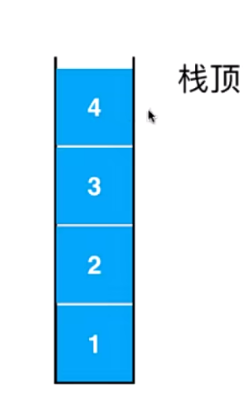

- 栈也是一种线性结构；相比数组，栈对应的操作是数组的子集；只能从**一端**添加元素，也只能从**同一端**取出元素，这一端称之为 **栈顶**，栈是一种 **后进后先出（Last In First Out--->LIFO）**的数据结构,在计算机的世界里，栈拥有不可思议的用处！

### 2.栈的应用

- 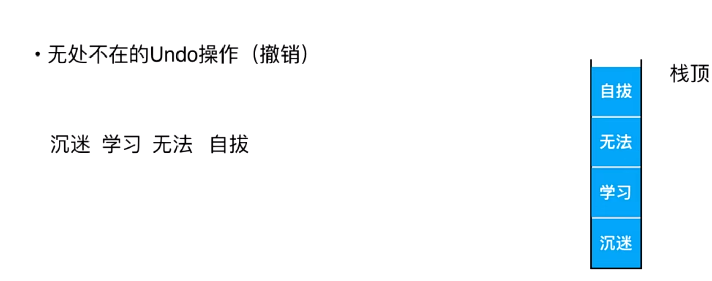
- 上图中：将输入的字符压入栈，执行一次撤销操作就取出栈内一个元素来修改
- 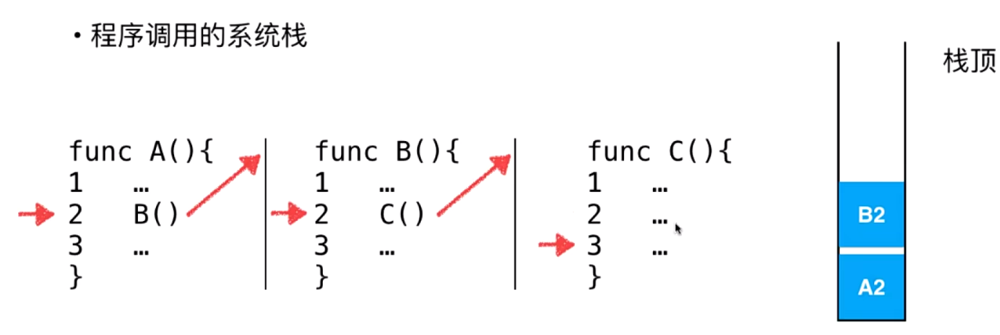
- 子过程子程序的调用，上图中：A()执行到第二步，存入A2到栈，执行B(), B()执行到第二步，存入B2执行C()，C()执行完，不知道执行谁了，取出栈内元素B2，执行完B()，又不知道执行谁，取出A2，执行完A(),A()执行完，栈空了，没有执行得了，就结束。

### 3.栈的实现（代码）

- ```java
  package dataStructure.interfaces;
  
  public interface Stack<E> {
      int getSize();
  
      boolean isEmpty();
  
      /**
       * 向栈中添加元素
       */
      void push(E e);
  
      /**
       * 向栈中取出元素
       * @return
       */
      E pop();
  
      /**
       * 看看栈顶的元素
       * @return
       */
      E peek();
  }
  
  
  
  package dataStructure;
  
  import dataStructure.interfaces.Stack;
  
  /**
   * 基于数组实现的栈
   * @param <E>
   */
  public class ArrayStack<E> implements Stack<E> {
      Array<E> array;
      public ArrayStack(int capacity){
          array = new Array<>(capacity);
      }
  
      public ArrayStack(){
          array = new Array<>();
      }
  
      @Override
      public int getSize(){
          return array.getSize();
      }
  
      @Override
      public boolean isEmpty(){
          return array.isEmpty();
      }
  
      /**
       * 看看栈容量
       * @return
       */
      public int getCapacity(){
          return array.getCapacity();
      }
  
      /**
       * 向栈内添加一个元素
       * @param e
       */
      @Override
      public void push(E e) {
          array.addLast(e);
      }
  
      /**
       * 向栈中取出元素，array里面移出元素方法会返回移出元素，具体看Array.java
       * @return
       */
      @Override
      public E pop() {
          return array.removeLast();
      }
  
      /**
       * 看看栈顶元素
       * @return
       */
      @Override
      public E peek() {
          return array.getLast();
      }
  
      @Override
      public String toString(){
          StringBuilder res = new StringBuilder();
          res.append("Stack: ");
          res.append('[');
          for (int i = 0; i < array.getSize(); i++){
              res.append(array.get(i));
              if (i != array.getSize() - 1){
                  res.append(", ");
              }
          }
          res.append("] top");
          return res.toString();
      }
  }
  ```

 

### 4.栈的复杂度分析

- 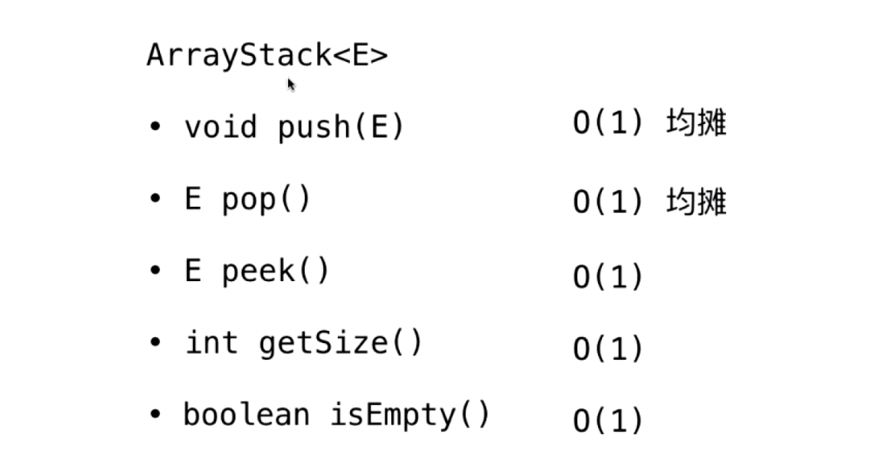


### 5.栈的另外一个应用（括号匹配）


- 给定一个只包括 `'('`，`')'`，`'{'`，`'}'`，`'['`，`']'` 的字符串 `s` ，判断字符串是否有效。

  有效字符串需满足：

  1. 左括号必须用相同类型的右括号闭合。
  2. 左括号必须以正确的顺序闭合。
  3. 每个右括号都有一个对应的相同类型的左括号。

- ```java
  import java.util.Stack;
  
  class Solution {
      public boolean isValid(String s) {
          Stack<Character> stack = new Stack<>();
          for(int i = 0; i < s.length(); i++){
              char c = s.charAt(i);
              if(c == '(' || c == '[' || c == '{'){
                  stack.push(c);
              }else{
                  if(stack.isEmpty()){
                      return false;
                  }
                  char topChar = stack.pop();
                  if(c == ')' && topChar != '('){
                      return false;
                  }
                  if(c == ']' && topChar != '['){
                      return false;
                  }
                  if(c == '}' && topChar != '{'){
                      return false;
                  }
              }
          }
          return stack.isEmpty();
      }
  }
  ```

## 四.队列 Queue

### 1.队列 基础

- 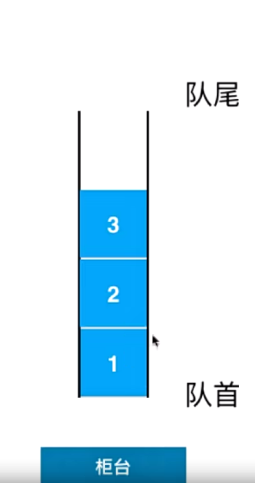
- 队列也是一种**线性结构**；相比数组，队列对应的操作是**数组的子集**；只能***从一端（队尾）添加元素***，只能***从另一端（队首）取出元素***，队列是一种***先进先出的数据结构（先到先得）,First In First Out(FIFO)***.


### 2.队列的实现

- ```java
  package dataStructure.interfaces;
  
  /**
   * 队列
   * @param <E>
   */
  public interface Queue<E> {
      int getSize();
  
      boolean isEmpty();
  
      /**
       * 向队列添加元素
       */
      void enqueue(E e);
  
      /**
       * 向队列中取出元素
       * @return
       */
      E dequeue();
  
      /**
       * 看看队首的元素
       * @return
       */
      E getFront();
  }
  
  
  
  
  package dataStructure;
  
  import dataStructure.interfaces.Queue;
  import dataStructure.interfaces.Stack;
  
  /**
   * 基于数组实现的队列
   * @param <E>
   */
  public class ArrayQueue<E> implements Queue<E> {
      Array<E> array;
      public ArrayQueue(int capacity){
          array = new Array<>(capacity);
      }
  
      public ArrayQueue(){
          array = new Array<>();
      }
  
      @Override
      public int getSize(){
          return array.getSize();
      }
  
      @Override
      public boolean isEmpty(){
          return array.isEmpty();
      }
  
      /**
       * 看看队列容量
       * @return
       */
      public int getCapacity(){
          return array.getCapacity();
      }
  
      /**
       * 向队列内添加一个元素
       * @param e
       */
      @Override
      public void enqueue(E e) {
          array.addLast(e);
      }
  
      /**
       * 向队列中取出元素（和栈不同，队列从头部取出），array里面移出元素方法会返回移出元素，具体看Array.java
       * @return
       */
      @Override
      public E dequeue() {
          return array.removeFirst();
      }
  
      /**
       * 看看队首元素
       * @return
       */
      @Override
      public E getFront() {
          return array.getFirst();
      }
  
      @Override
      public String toString(){
          StringBuilder res = new StringBuilder();
          res.append("Queue: ");
          res.append("front [");
          for (int i = 0; i < array.getSize(); i++){
              res.append(array.get(i));
              if (i != array.getSize() - 1){
                  res.append(", ");
              }
          }
          res.append("] tail");
          return res.toString();
      }
  
      public static void main(String[] args) {
          ArrayQueue<Integer> queue = new ArrayQueue<>();
          for (int i = 0; i < 10; i++) {
              queue.enqueue(i);
              System.out.println(queue);
              if (i % 3 == 2){
                  queue.dequeue();
                  System.out.println(queue);
              }
          }
      }
  }
  
  ```

### 3. 数组队列的复杂度分析

- 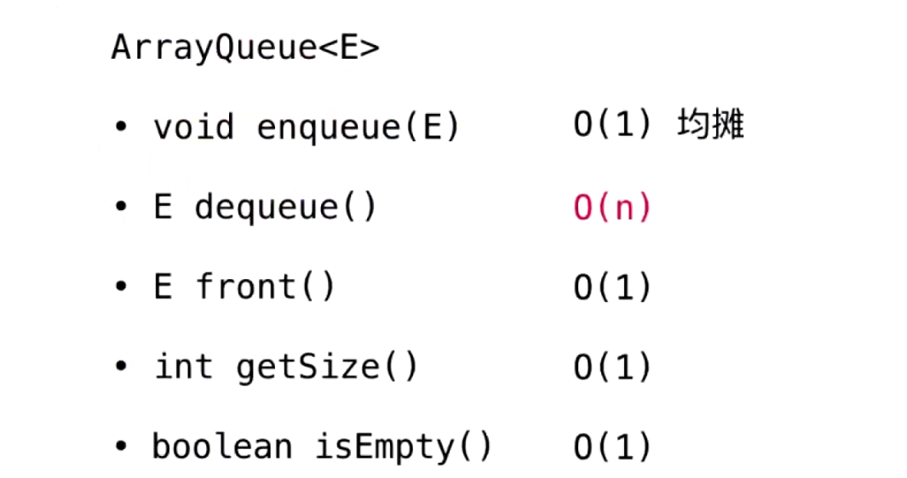

### 4.数组队列的问题

- 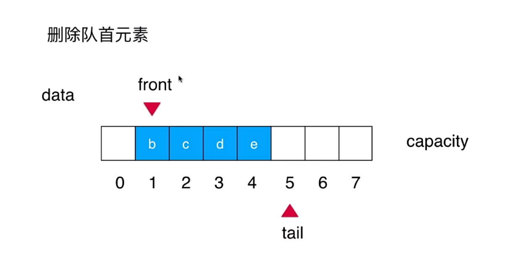

- 删除队首后，所有元素需要向前挪动一位，所以复杂度是O（n），但是如果只是将 front(队首)指向索引为1的位置，也就是只维护front不去移动元素，及front++，这就引出**循环队列**的方式。


### 5.循环队列

-  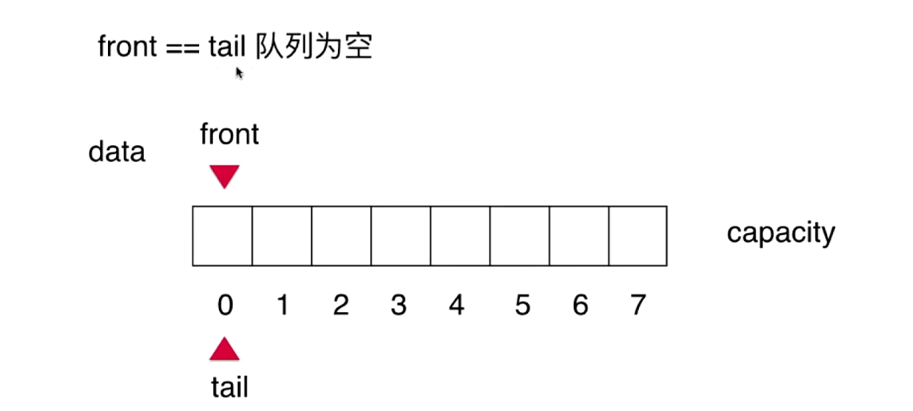

- 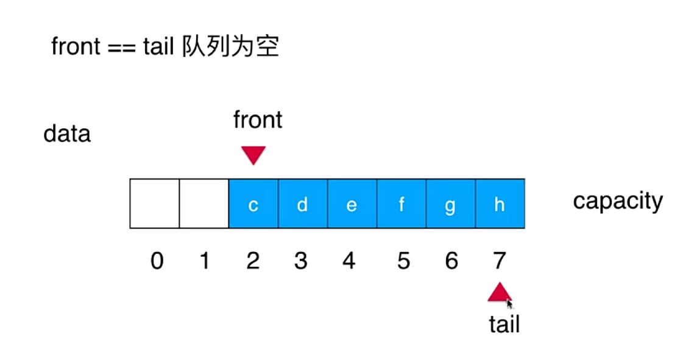
- 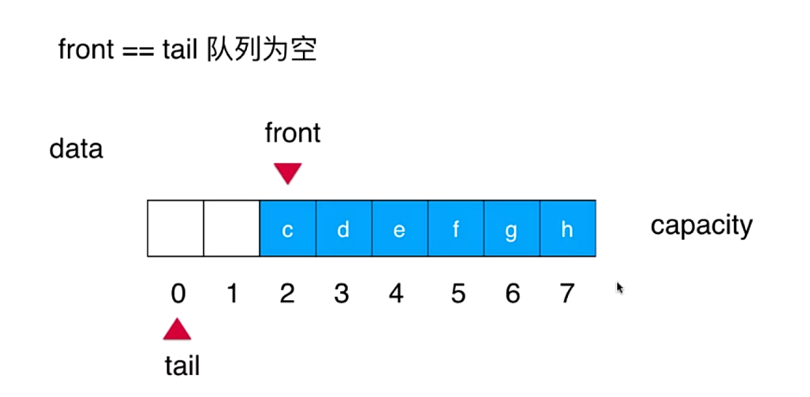
- 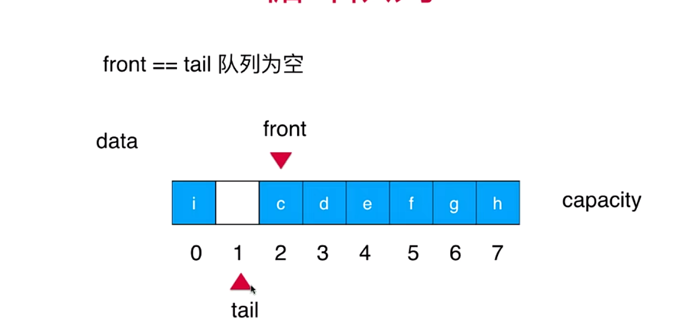
- **front指向队列第一个元素的索引位置，tail指向队列最后一个元素的后一个位置，当front==tail时队列为空，如果 tail+1 == front，即表示队列满，如上图**,有意识的浪费一个空间。
- ***入队***：维护tail,只需要tail++，严格意义来说不是++，而是（tail+1）% capacity
- ***出队***：维护front,front++


### 6 循环队列代码

- **仔细看注释**

- ```java
  package dataStructure;
  
  import dataStructure.interfaces.Queue;
  
  /**
   * 循环队列
   * @param <E>
   */
  public class LoopQueue<E> implements Queue<E>{
      private E[] data;
      //队首、队尾
      private int front, tail;
      //队列有多少元素
      private int size;
  
      public LoopQueue(int capacity){
          //具体看笔记，要有意识的浪费一个空间，tail+1 == front，即表示队列满
          data = (E[]) new Object[capacity + 1];
          front = 0;
          tail = 0;
          size = 0;
      }
  
      public LoopQueue(){
          this(10);
      }
  
      /**
       * 得到队列容量
       * @return
       */
      public int getCapacity(){
          //新建时加了一个空间
          return data.length - 1;
      }
  
      /**
       * 判断队列是否为空，当front==tail时队列为空
       * @return
       */
      @Override
      public boolean isEmpty(){
          return front == tail;
      }
  
      /**
       * 或者队列有多少元素
       * @return
       */
      @Override
      public int getSize(){
          return size;
      }
  
      /**
       * 入队操作，只维护tail,  ==（tail+1）% capacity
       * @param e
       */
      @Override
      public void enqueue(E e){
          //data.length == capacity+1,取余之后就是满的
          if ((tail + 1) % data.length == front){
              resize(getCapacity() * 2);//扩容
          }
          data[tail] = e;
          tail = (tail + 1) % data.length;
          size++;
      }
  
      /**
       * 出队操作 只维护front,  ==（tail+1）% capacity
       * @return
       */
      @Override
      public E dequeue(){
          if (isEmpty()){
              throw new IllegalArgumentException("Cannot dequeue from an empty queue.");
          }
          E ret = data[front];
          data[front] = null;
          front = (front + 1) % data.length;
          size --;
  
          //如果入队增加了很多容量，出队是发现空的太多就缩容
          if (size == getCapacity() / 4 && getCapacity() / 2 != 0){
              resize(getCapacity() / 2);
          }
          return ret;
      }
  
      @Override
      public E getFront(){
          if (isEmpty()){
              throw new IllegalArgumentException("Queue is empty.");
          }
          return data[front];
      }
  
      private void resize(int newCapacity){
          E[] newData = (E[]) new Object[newCapacity + 1];
          for (int i = 0; i < size; i++){
              /**
               * 将原队列元素放在新队列，可能原循环队列队首不在0位置，所以要做处理
               * newData[0] = data[front]
               * newData[1] = data[front + 1]
               * ...
               * 因为整个队列是循环队列，整个队列要循环起来，避免front + 1超过data.length，产生越界，所以对data.length取余
               */
              newData[i] = data[(i + front) % data.length];
          }
          data = newData;
          front = 0;
          tail = size;//下标从0开始，有7个元素就是7，但是最后一个元素在索引为6的位置，所tail在最后一个元素后一位条件满足
      }
  
      @Override
      public String toString(){
          StringBuilder res = new StringBuilder();
          res.append(String.format("LoopQueue: size = %d , capacity = %d\n", size, getCapacity()));
          res.append("front [");
  
          /**
           * 从front开始，最后一个元素是tail-1，但因为是循环队列，所以tail可能比front还要小
           * 所以 i 不能取到 tail，i != tail
           * 所以每次i应该是 (i+1) % data.length
           */
          for (int i = front ; i != tail; i = (i+1) % data.length){
              res.append(data[i]);
              if ((i + 1) % data.length != tail){//当前元素不是队列最后一个元素
                  res.append(", ");
              }
          }
          res.append("] tail");
          return res.toString();
      }
  
  
      public static void main(String[] args) {
          LoopQueue<Integer> queue = new LoopQueue<>();
          for (int i = 0; i < 10; i++) {
              queue.enqueue(i);
              System.out.println(queue);
              if (i % 3 == 2){
                  queue.dequeue();
                  System.out.println(queue);
              }
          }
      }
  }
  ```

### 7.循环队列的复杂度分析

- 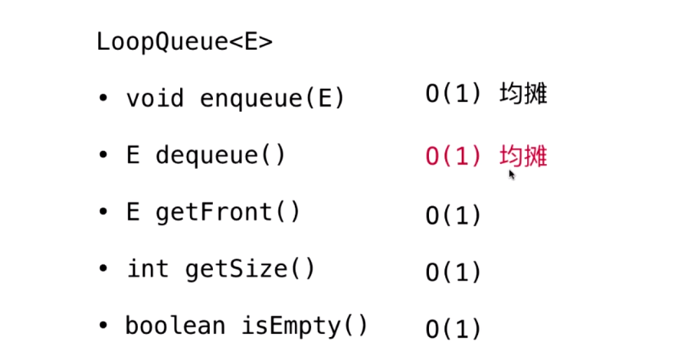

### 8.数组队列和循环队列的比较

- ```java
  package test;
  
  import dataStructure.ArrayQueue;
  import dataStructure.LoopQueue;
  import dataStructure.interfaces.Queue;
  
  import java.util.Random;
  
  /**
   * 数组队列和循环队列的效率测试
   */
  public class QueueTest {
      /**
       * 测试使用q运行opCount个enqueue和dequeue操作所需要的时间，单位秒
       * @param q
       * @param opCount
       * @return
       */
      private static double testQueue(Queue<Integer> q, int opCount){
          long startTime = System.nanoTime();
  
          Random random = new Random();
          for (int i = 0; i < opCount; i++) {
              q.enqueue(random.nextInt(Integer.MAX_VALUE)); // 生成0-Int最大值的数入队
          }
  
          for (int i = 0; i < opCount; i++) {
              q.dequeue(); // 出队
          }
  
          long endTime = System.nanoTime();
  
          return (endTime - startTime) / 1000000000.0;
      }
      public static void main(String[] args) {
          //操作次数
          int opCount = 100000;
  
          ArrayQueue<Integer> arrayQueue = new ArrayQueue<>();
          double time1 = testQueue(arrayQueue,opCount);
          System.out.println("ArrayQueue, time:" +time1 + " s");
  
          LoopQueue<Integer> loopQueue = new LoopQueue<>();
          double time2 = testQueue(loopQueue,opCount);
          System.out.println("LoopQueue, time:" +time2  + " s");
      }
  }
  
  ```

- 入队、出队操作比较结果：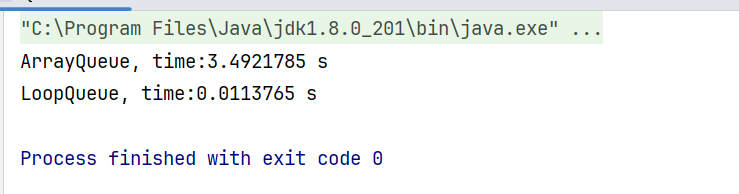

### 9.队列作业（不浪费一个空间的循环队列）

- 作业解析：***不浪费一个空间实现队列***，实际上我们想要实现一个队列，使用size记录了队列中有多少元素，完全可以不浪费那一个空间，参考代码如下，下面编写的LoopQueue的实现中，将不浪费那1个空间。

- ```java
  package test;
  
  import dataStructure.interfaces.Queue;
  
  public class LoopQueue<E> implements Queue<E> {
  
      private E[] data;
      private int front, tail;
      private int size;
  
      public LoopQueue(int capacity){
          data = (E[])new Object[capacity]; // 由于不浪费空间，所以data静态数组的大小是capacity
          // 而不是capacity + 1
          front = 0;
          tail = 0;
          size = 0;
      }
  
      public LoopQueue(){
          this(10);
      }
  
      public int getCapacity(){
          return data.length;
      }
  
      @Override
      public boolean isEmpty(){
          // 注意，我们不再使用front和tail之间的关系来判断队列是否为空，而直接使用size
          return size == 0;
      }
  
      @Override
      public int getSize(){
          return size;
      }
  
      @Override
      public void enqueue(E e){
  
          // 注意，我们不再使用front和tail之间的关系来判断队列是否为满，而直接使用size
          if(size == getCapacity())
              resize(getCapacity() * 2);
  
          data[tail] = e;
          tail = (tail + 1) % data.length;
          size ++;
      }
  
      @Override
      public E dequeue(){
  
          if(isEmpty())
              throw new IllegalArgumentException("Cannot dequeue from an empty queue.");
  
          E ret = data[front];
          data[front] = null;
          front = (front + 1) % data.length;
          size --;
          if(size == getCapacity() / 4 && getCapacity() / 2 != 0)
              resize(getCapacity() / 2);
          return ret;
      }
  
      @Override
      public E getFront(){
          if(isEmpty())
              throw new IllegalArgumentException("Queue is empty.");
          return data[front];
      }
  
      private void resize(int newCapacity){
  
          E[] newData = (E[])new Object[newCapacity];
          for(int i = 0 ; i < size ; i ++)
              newData[i] = data[(i + front) % data.length];
  
          data = newData;
          front = 0;
          tail = size;
      }
  
      @Override
      public String toString(){
  
          StringBuilder res = new StringBuilder();
          res.append(String.format("Queue: size = %d , capacity = %d\n", size, getCapacity()));
          res.append("front [");
  
          // 注意，我们的循环遍历打印队列的逻辑也有相应的更改 :-)
          for(int i = 0; i < size; i ++){
              res.append(data[(front + i) % data.length]);
              if((i + front + 1) % data.length != tail)
                  res.append(", ");
          }
          res.append("] tail");
          return res.toString();
      }
  
      public static void main(String[] args){
  
          LoopQueue<Integer> queue = new LoopQueue<>();
          for(int i = 0 ; i < 10 ; i ++){
              queue.enqueue(i);
              System.out.println(queue);
  
              if(i % 3 == 2){
                  queue.dequeue();
                  System.out.println(queue);
              }
          }
      }
  }
  ```


### 10.队列作业(没有size成员变量的循环队列）

- 作业解析：浪费一个空间，**但不使用size实现队列**。如果不使用size,也完全可以实现整个队列，但是，相应的，我们需要浪费一个空间。以下是代码。

- ```java
  package test;
  
  import dataStructure.interfaces.Queue;
  
  public class LoopQueue<E> implements Queue<E> {
  
      private E[] data;
      private int front, tail;
  
      public LoopQueue(int capacity){
          data = (E[])new Object[capacity + 1];
          front = 0;
          tail = 0;
      }
  
      public LoopQueue(){
          this(10);
      }
  
      public int getCapacity(){
          return data.length - 1;
      }
  
      @Override
      public boolean isEmpty(){
          return front == tail;
      }
  
      @Override
      public int getSize(){
          // 注意此时getSize的逻辑:
          // 如果tail >= front，非常简单，队列中的元素个数就是tail - front
          // 如果tail < front，说明我们的循环队列"循环"起来了，此时，队列中的元素个数为：
          // tail - front + data.length
          // 画画图，看能不能理解为什么？
          //
          // 也可以理解成，此时，data中没有元素的数目为front - tail,
          // 整体元素个数就是 data.length - (front - tail) = data.length + tail - front
          return tail >= front ? tail - front : tail - front + data.length;
      }
  
      @Override
      public void enqueue(E e){
  
          if((tail + 1) % data.length == front)
              resize(getCapacity() * 2);
  
          data[tail] = e;
          tail = (tail + 1) % data.length;
      }
  
      @Override
      public E dequeue(){
  
          if(isEmpty())
              throw new IllegalArgumentException("Cannot dequeue from an empty queue.");
  
          E ret = data[front];
          data[front] = null;
          front = (front + 1) % data.length;
          if(getSize() == getCapacity() / 4 && getCapacity() / 2 != 0)
              resize(getCapacity() / 2);
          return ret;
      }
  
      @Override
      public E getFront(){
          if(isEmpty())
              throw new IllegalArgumentException("Queue is empty.");
          return data[front];
      }
  
      private void resize(int newCapacity){
  
          E[] newData = (E[])new Object[newCapacity + 1];
          int sz = getSize();
          for(int i = 0 ; i < sz ; i ++)
              newData[i] = data[(i + front) % data.length];
  
          data = newData;
          front = 0;
          tail = sz;
      }
  
      @Override
      public String toString(){
  
          StringBuilder res = new StringBuilder();
          res.append(String.format("Queue: size = %d , capacity = %d\n", getSize(), getCapacity()));
          res.append("front [");
          for(int i = front ; i != tail ; i = (i + 1) % data.length){
              res.append(data[i]);
              if((i + 1) % data.length != tail)
                  res.append(", ");
          }
          res.append("] tail");
          return res.toString();
      }
  
      public static void main(String[] args){
  
          LoopQueue<Integer> queue = new LoopQueue<>();
          for(int i = 0 ; i < 10 ; i ++){
              queue.enqueue(i);
              System.out.println(queue);
  
              if(i % 3 == 2){
                  queue.dequeue();
                  System.out.println(queue);
              }
          }
      }
  }
  
  
  ```

- 
